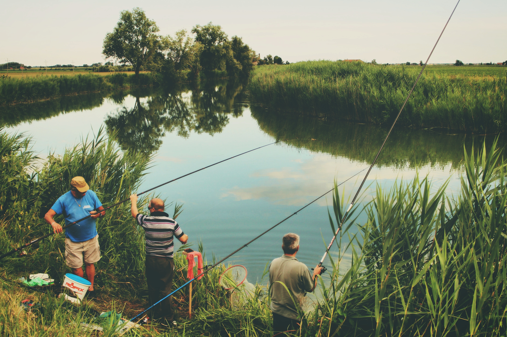

We often get surprised by the decisions taken by those around us. _"But how could you not see that this whole Bitcoin thing was a bubble?"_, or _"how can you pass on that job opportunity?"_, or _"did you not know that there are more parts that need to be built here, and so this project will take more than the estimated time?"._ Turns out, people make decisions based on their **Bounded Rationality** (and so do you).

> Bounded rationality means that people make quite reasonable decisions based on the information they have. But they don’t have perfect information, especially about more distant parts of the system.
>
> Donella H. Meadows, [Thinking in Systems](https://www.goodreads.com/book/show/3828902-thinking-in-systems)

As a simple example, think of a fishing ecosystem. The fishermen benefit directly from how many fishes they catch every day. Ideally, the fish population that is lost by fishing or other causes (pollution, ageing etc.) gets replenished by natural reproduction. But the fishermen start overfishing to maximise their benefits, bringing the fish population below a critical number and natural reproduction alone is no more sufficient to replenish the fish population. The fishermen end up destroying their own livelihood.

*Fishermen tend to overfish to maximise their benefits. Photo by [Iva Rajović](https://unsplash.com/photos/MhcWRAtSsro?utm_source=unsplash&utm_medium=referral&utm_content=creditCopyText) on [Unsplash](https://unsplash.com/search/photos/fishermen?utm_source=unsplash&utm_medium=referral&utm_content=creditCopyText)*

Why couldn't the fishermen foresee this? The more you fish, the lesser there will be left, isn't that intuitive? No. Because the fishermen don't know how much fish is there in the pond, or how many fishes will be caught by other fishermen the same day. They have a bounded view of the reality (the same example is also suitable for describing ["Tragedy of the Commons"](https://en.wikipedia.org/wiki/Tragedy_of_the_commons)).

## We would probably take the same decisions we criticize right now

However much we criticize the decisions made by someone else in a different position than ours, **we tend to make the same decisions when put in their roles, subject to the same information flows, incentives, disincentives and goals as they are**. As Donella Meadows notes, _"We teach this point by playing games in which students are put into situations in which they experience the realistic, partial information streams seen by various actors in real systems. As simulated fishermen, they over fish. As ministers of simulated developing nations, they favour the needs of their industries over the needs of their people. As the upper class, they feather their own nests; as the lower class, they become apathetic or rebellious. **So would you.**"_

But:

> **Seeing how individual decisions are rational within the bounds of the information available does not provide an excuse for narrow-minded behaviour.** It provides an understanding of why that behaviour arises. Within the bounds of what a person in that part of the system can see and know, the behaviour is reasonable. Taking out one individual from a position of bounded rationality and putting in another person is not likely to make much difference. **Blaming the individual rarely helps create a more desirable outcome.**
>
> Donella H. Meadows

In order to not get surprised by the outcomes of our/others' "rational" decisions, I think it is valuble to:

1. Keep in mind that the decision you are going to take might have effects you don't know of/want because you have a bounded view of the problem. Go out of your way then to understand what other knowledge exists and how can you incorporate that in your decision.
2. When criticizing any decision (that feature that someone built?), make sure you take a moment to think of what all information was available when the decision was made (I touch on taking and giving feedback in [another blog post](https://ketanbhatt.com/2018/12/10/on-taking-feedback-well/)).

## Create systems that function well despite bounded rationality

So does it mean that we will always end up making the wrong decisions? No. Some systems, like our liver/heart, are structured to function well despite bounded rationality. **The right feedback gets to the right place at the right time.** What if we could structure our teams/organisation in the same way? What if each of the stakeholders got at least all the information they need to make an "informed" decision?
Doesn't that also explain why we call for diversity in teams? Because diversity is one way of ensuring you get a lot of different perspectives/information flows that help you make better, more inclusive, decisions as a team.

> **The bounded rationality of each actor in a system may or may not lead to decisions that further the welfare of the system as a whole.** If they do not, putting new actors into the same system will not improve the system’s performance. **What makes a difference is redesigning the system to improve the information, incentives,** disincentives, goals, stresses, **and constraints that have an effect on specific actors.**
>
> Donella H. Meadows

*Nature often creates self-regulatory systems. Photo by [Charles Postiaux](https://unsplash.com/photos/3Fbk3q1tMaQ?utm_source=unsplash&utm_medium=referral&utm_content=creditCopyText) on [Unsplash](https://unsplash.com/search/photos/fish?utm_source=unsplash&utm_medium=referral&utm_content=creditCopyText)*

## In closing

The concept is simple, and we might also have an understanding of it on the subconscious level, but having a term for it in our vocabulary means we are more aware of its existence, and therefore much more enabled to account for it.

> To paraphrase a common prayer: God grant us the serenity to exercise our bounded rationality freely in the systems that are structured appropriately, the courage to restructure the systems that aren't, and the wisdom to know the difference!
>
> Donella H. Meadows
