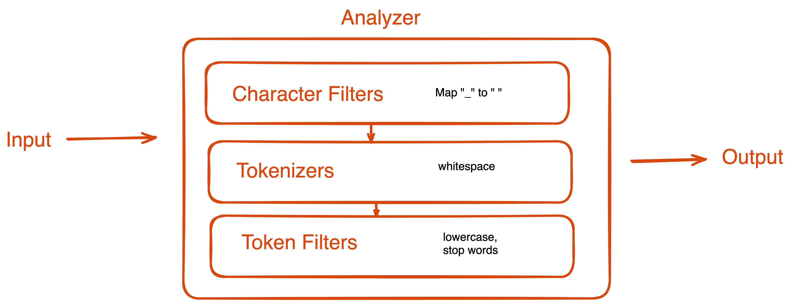
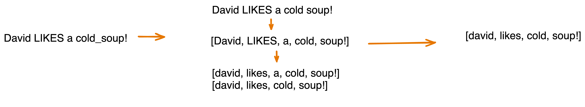

Hello. Thanks for arriving at this page, even though there is no mention of LLMs and ChatGPT here.

I spent my last two years in Intercom working with the Core Technologies team, with Elasticsearch being the core technology I focussed on. As part of my work, I got to build and consult other teams building search experiences in the Intercom product. If you use Intercom, and you have searched for conversations, you have come across my work.

I have now moved on to the AI Group in Intercom, but I wanted to note down learnings from my time building these search experiences. In addition to other people finding these useful, I find myself coming back to these articles when I need to in the future.

Even though we use Elasticsearch at Intercom, the advice here will hold for Opensearch too.

## Start with a contract
This is the most important learning. **Write down the cases that you are and aren’t covering.**

In most areas of building software, you start with functional and non-functional requirements. If you are building a webpage, you have a design you have to implement. If you are building the backend for a website, you first agree on the API that you will use to interact with the frontend.

With search interfaces, I have found that the requirements tend to be more hand-wavy. On the surface, the goal is easy: The results should be relevant.
But how is “relevance” defined? As we start digging, we start defining "relevance" for our use-case:
* Should we support spelling errors?
* How should we handle special characters?
* For a multi-term input, should results where the terms exist in the same order as the input be ranked higher?
* And how much weight should the “age” of a result play in the ordering?

I enjoy this process of figuring out what’s important for the user. It is crucial to note down the conclusions you arrive at after disambiguating the requirements. You might have to make tradeoffs as you build the experience. **The contract helps you document the tradeoffs you have made and why.**

Once you can see all the requirements together, you also have a better chance at designing your mapping and queries to support the requirements in the best manner.

#### Add tests for the contract
I have found that it is easy to cause regressions by seemingly small changes to the query/mapping. Simple tests that ingest a few dummy documents and confirm that the results are as expected can do wonders for reducing these regressions and allowing you to iterate with speed.

## Understand the Text Analysis pipeline
Elasticsearch performs text analysis when indexing or searching `text` fields. Based on your requirements, you might have to tune the analysis pipeline for your specific needs: Should you remove stop words? Should you tokenize on whitespace? Should you convert your tokens to n-grams?

Elasticsearch has a helpful section in their documentation about Text Analysis: [Text analysis](https://www.elastic.co/guide/en/elasticsearch/reference/current/analysis.html). My advice is to get familiar with this part of the documentation, specially [Anatomy of an analyzer](https://www.elastic.co/guide/en/elasticsearch/reference/current/analyzer-anatomy.html).  I created a simple diagram to remind me of the concept. This is how text analysis works:

Given an input, this is how the output will be generated.

Knowing how the text analysis works will help you decide the schema of your fields and writing a search query that works for you. It also helps you debug your queries and search results when someone complains in the future (_“why is this document not being returned”_).

## Do you really need to support Typos?
When we think of supporting misspelled words, we think it will help people find `apple` when they typed `aple` by mistake. But it also means that you could return `bat` when someone actually needed `bar`.
Typo tolerance can also return irrelevant results if the user input can be a number: So if someone searches for `98765`, they probably don’t want `88765`.

Supporting typos is useful in many cases but it comes with a cost: queries handling misspellings are usually slower to run and can lead to lower quality of results.

**My suggestion is to avoid typo tolerance unless your use-case would really benefit from it.**
If you do have to support typos, consider setting the [fuzziness](https://www.elastic.co/guide/en/elasticsearch/reference/current/common-options.html#fuzziness) such that only mistakes in longer words are supported, as people tend to make fewer mistakes in shorter words.

## Don’t be afraid to use multiple fields
As you go over the different cases you uncovered while creating the contract, it will become clear that ingesting the data into a single field might not be enough. 

For example: If a user searches for `running`, you want to return results containing `run`. But when the user searches for `"running"`, you want to return results that contain the word `running` exactly. This could be difficult to do using a single field.

Usually something I have seen working is having one field that indexes your text as is (without even removing stop words), and another field analyzed for similarity matching (whatever similarity means for you: removing stop words, stemming, etc.).

## Not all text is the same
Your user might be expecting different behaviour based on the text they are searching over. Smaller text fields (like blog titles, movie titles) require different analysis than longer text fields (like blog content, movie synopsis). 

For example: if the user knows they have a title like `The legend of Tarzan`, and they input `the`, they would expect Tarzan to be in the results. But if you removed stop words during the text analysis, the legend of Tarzan will remain a myth. This can be frustrating for the user.

**For searching over smaller text fields, a simple WYSIWYG approach might be good enough and it might make sense to skip most of the text analysis**: skip stemming, removing stop words, removing punctuations etc.
Also consider using an edge-n-gram Index analyser and standard Search analyser for such a use-case. (Elasticsearch usually advises against using different analysers for indexing and search, but mentions this specific case as a good candidate for going against the suggestion: [Here](https://www.elastic.co/guide/en/elasticsearch/reference/current/search-analyzer.html#:~:text=Sometimes%2C%20though%2C%20it%20can%20make%20sense%20to%20use%20a%20different%20analyzer%20at%20search%20time%2C%20such%20as%20when%20using%20the%20edge_ngram%20tokenizer%20for%20autocomplete)).

For longer text fields, running a more involved text analysis can improve results quality. And if a user's search for `the` doesn't return all the blogs that contain the word `the` in them, the behaviour is still intuitive for them.

## Increasing relevance by using multiple clauses
For improving user experience, you will want to rank more relevant results higher. For example: for a multi-term input, you may want to show those results first where all the terms are present in the same order as in the input.

You can use `should` clauses in your query to add weight to more relevant results. For this particular example, you can add a `should` clause with a `phrase` match to boost the relevance of documents that contain the words in the same order.

## When you can’t depend on score
If you can sort results by score, things become easier. Your search query could still match some results with low-relevance, but that might be okay because they would be buried deep behind more relevant results.

But some use-cases require results to be sorted by other fields (frequently, `created_at`). For example: while searching for blog titles, it will be easier for the user to go through all the results if they are sorted by their published date. But if your query returns both highly and somewhat-relevant blogs, and the results were sorted by `published date`, you might end up showing irrelevant (but recent) results at the top!

In such cases, you want to tighten your query to only return results that are perfect matches for the user input. This allows for the results to be sorted by any field and still be relevant for the user.
 

### Minimum Should Match
One of the ways of only matching relevant results is by using `minimum_should_match` and using a value like `2<90%` which would only return those documents where most of the words from the input are present. Documentation: [minimum\_should\_match parameter](https://www.elastic.co/guide/en/elasticsearch/reference/current/query-dsl-minimum-should-match.html).

Hope it helps 👋

