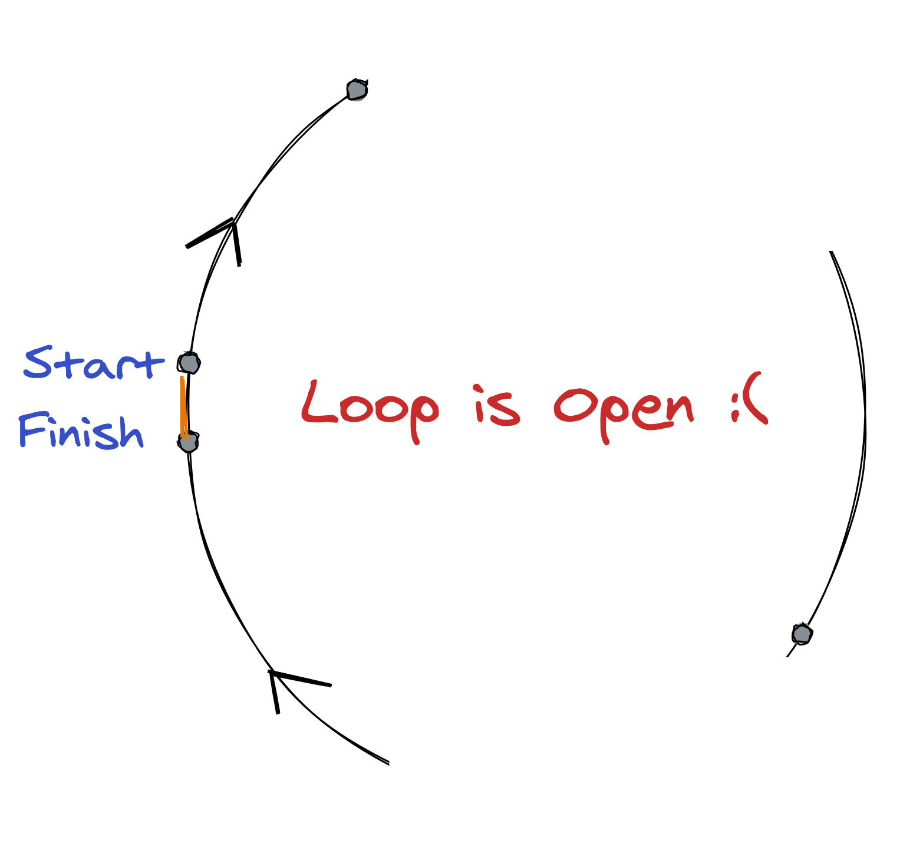

I re-learnt something recently: the importance of closing the loop on a system you are trying to build, as quickly as possible, and then adding the juicy bits later (Thank you Kesha for helping me with the concept 😊).

A completely finished "loop" is when you can provide the required input to your system, and it produces the desired output (or side effects, if that's how you like it). The "Close the loop first" technique is about closing this loop as fast as possible by creating a barebones version of it first, providing all or some required inputs, and generating a partial form of the desired output.
Once we have closed this barebones loop, we can then begin implementing behaviours from the inside out, so that with each new change our loop starts looking more like the actual system we want.

Sure, this is nothing new, right? We have all heard of this advice in various forms: build a proof of concept as quickly as possible; validate the unknowns first; if you want to deliver a car, deploy a skateboard first, etc. This is similar, but I am talking today purely from a "programming" point of view. **In addition to helping you fail fast, "closing the loop" first also lets you build systems with more speed.**

## How exactly does it help? 🤔

Let's look at what I am trying to say using a simple example.

_You have some data in Comma Separated Value (CSV) format. You have to read the file and for each row, clean a few columns, check if the row exists in a database table. If it does, update it, otherwise create a new row in the database. We also want to create a new CSV file that has an extra column specifying if the row was created or updated in the database._

We know how we will roughly do it. Read the CSV file, and for each row:

1. Clean columns as necessary
2. Check if row is already in the database
    1. If it is already present, update it
    2. Else, create a new row
3. Add this row to a new CSV file with an extra column for creation/updation information.

We can go about writing our code in this exact order, or we can "close the loop" first, and then add capabilities to our code.



We start with an open loop

### Step 1: Close the Loop!

**Read the CSV and add each row to another CSV, with a new column "operation"**

To be able to close the loop quickly, we will just add a static value `"created"` to the new `"operation"` column.
Also add tests to check that each row in the input file is present in the output file, and that a new column exists.

```py
import csv

def close_the_loop():
    input_file = open('data.csv', 'r')
    output_file = open('output.csv', 'w')

    input_csv = csv.DictReader(input_file)
    headers = input_csv.fieldnames + ['operation']
    output_csv = csv.DictWriter(output_file, headers)

    for row in input_csv:
        row['operation'] = 'created'
        output_csv.writerow(row)

    input_file.close(), output_file.close()

```

_\* I wanted to make the code more readable, for a blog, by having less indents. Otherwise a better way to read files in Python is by opening the file using `with`_.


Aaaaaaand....the loop is closed!

### Step 2: Add juicy bits

**For each row, call a dummy method that will later implement the DB operation, but right now returns "updated/created".**

Update your test to check the correct value of the `operation` column based on what you mocked it with.

```py
...

def update_or_create(row):
    return 'created'

def close_the_loop():
    ...

    for row in input_csv:
        row['operation'] = update_or_create(row)
        output_csv.writerow(row)

    ...
```

**Actually implement the `update_or_create` method**

Add a new unit test for `update_or_create`. By this point, you are almost done.

**Add a method to do some data cleaning before writing to the output file.**

Also update your tests to account for this change.

```py
...

def clean_row(row):
    row['name'] = row['name'].strip

def close_the_loop():
    ...

    for row in input_csv:
        clean_row(row)
        row['operation'] = update_or_create(row)
        output_csv.writerow(row)

    ...
```


Aaaaaaaaand...work is done!

## How does this work?

Even though it sounds like the same advice, I instantly visualised it when Kesha brought it up and said "let's close the loop first". I am a very visual person, and this created an image in my mind of a loop that needed closing. And when that loop gets closed, that's another **extremely** satisfying image. For me, this image is important because we regularly hear about a lot of best practices and design patterns, but what really matters is how many of them can we remember to apply to our situation when we actually sit down to implement stuff. Visualising a concept helps me remember it for a longer time.


*Photo by [HUZAIFA SHEIKH](https://unsplash.com/@huzy_sheikh?utm_source=unsplash&utm_medium=referral&utm_content=creditCopyText) on [Unsplash](https://unsplash.com/?utm_source=unsplash&utm_medium=referral&utm_content=creditCopyText)*

Other than allowing you to build you system quickly, piece by piece, there are other related benefits with this approach:

1. You get to "executing" code quickly, which helps you add more code faster and with more confidence (as you can quickly check if it is working or not by running your code, hopefully using the basic test you wrote).
2. Instead of getting 20 failures, across the entirety of those 2000 lines of code that you changed, you get fewer errors as you build your system bit by bit. Most of these errors would be around your latest changes and, thus, easier to debug and fix.
3. If you plan correctly, you can prioritise and selectively add capabilities to your system (maybe do the optimisations after initial deployment?) as you build. This helps you deliver basic capabilities as fast as possible, and sometimes that's all what is needed (\*cough\* startups \*cough\*).
4. And of course, all the benefits of failing fast or uncovering the unknowns first are still valid: If your assumptions prove out to be wrong, your time investment is minimal at this point, and you can still figure out a way to work around this new-found information.

### Caveats

Of course, this isn't a standalone best practice that you can implement in isolation. You need to already have a clearer picture of what you are trying to build.
And then, of course, some people might like it better to implement end to end in one go.
And then there are things that are better implemented that way.

All this is, is a tool. Use it where you think it can be useful.

Ciao!
