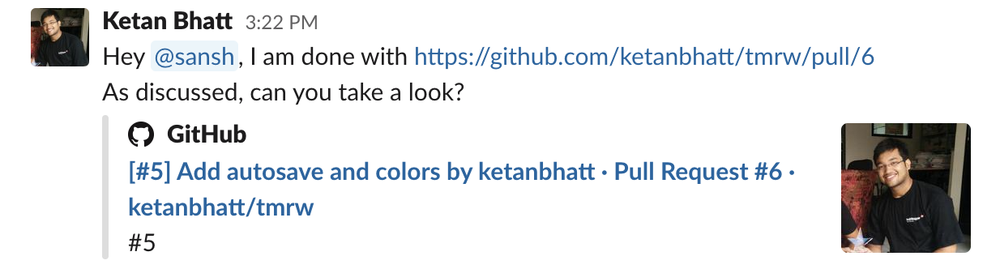
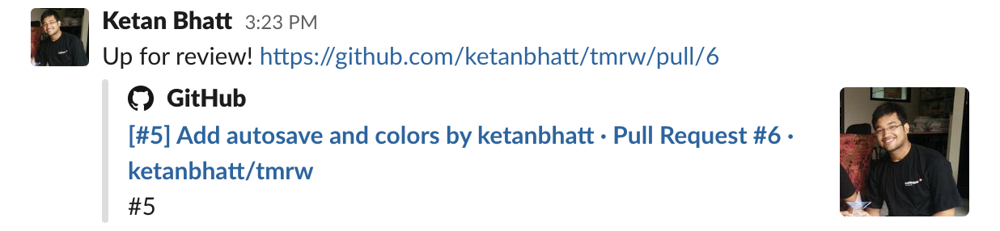
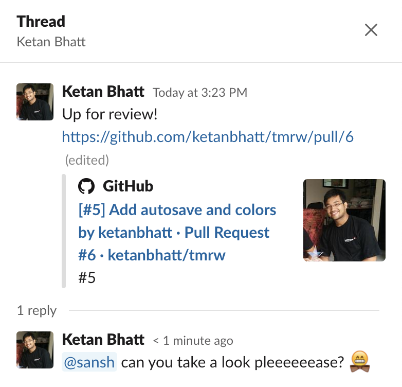

Disclaimer: I am not talking about what code reviews are, and how to do them well. There are plenty of good resources for that, eg: [link][1]. I am writing about the process a team follows before their code comes for review.

For a long time, I thought there was only one way how teams ran their code reviews. This was based on my, rather limited, experience of working in a small organization. Even when an ex-colleague told me about the process followed in their new job, I couldn't comprehend how this other system could work and dismissed it without giving it much thought.

After recently moving to a _largeish_ organization myself, I am on the other side now. This move has helped me experience a lot of alternate ways of doing the same things. One such is code reviews. Now that I have experienced this "other" process, I start to understand how it would work and how it could be useful for teams of 4 people or more. I now regret not trying this approach out in my previous team, and getting to see how it fares. Maybe I could have unlocked a whole level of effectiveness, knowledge sharing and efficiency for my team? Now we will never know 😬.

My intention in this article is to introduce people, with a similar experience as mine, to this other system of running code reviews. I do not know if there are more common ways of referring to these systems, so I am going to make up some headings. Please 🐻 with me.

## I. Explicit Assignment 🤝

Whenever a new piece of work is taken up, it is assigned to at least two people. One of the assignees is considered to be the "Primary" owner for the task and is going to be the person in charge of getting the work done. The other person is the "Secondary" owner and is mostly the explicit, pre-decided, owner for design and code reviews for this piece of work.

This is the process my older team followed. I asked a few of my developer-friends working in smaller companies and they mentioned that their teams follow a similar process as well.

### What I like about this process
1. You always have a go-to person to discuss the issue at hand, and between the two of you, you can arrive at a consensus without waiting for more agreements. Like in distributed systems, reaching consensus with 2 people is easier than with >2 people (but you are trading off reliability for speed, so don't quote me on that!).
2. In theory, since the reviewer has prior information, they can plan and pre-allocate time for it. This helps in getting timely reviews done without creating ad-hoc distractions for the reviewer.
    -  _In practice, I found that it is difficult to stick to these plans almost half the time. The Pull Request might not be ready for review in time; the reviewer might have under/over-estimated the task they were working on and might get free earlier/later than planned. Effectiveness in these cases goes out the window._

        _In a system where anyone can review a Pull Request, you mostly don't have to wait long before someone gets time to look at your code. There is at least one person at any given time with available bandwidth. Economies of scale?_

### What I wish could be better
1. If the Secondary Owner is unavailable, work is either blocked or delayed, or someone else needs to help. This, in turn, delays/blocks the piece of work this person was originally supposed to spend time on. On the other hand, **while the Primary owner is waiting for their code to be reviewed, they might pick up new work. This goes against the popular time-tested advice of limiting "Work in Progress" and ensuring fast flow** (_["The Phoenix Project"][3] talks about it in detail. They, in turn, have picked up on this advice from ["The Goal"][4]_).
2. In a more specific example of the adage, **_"When everyone is responsible, no one is responsible"_, having multiple owners often lead to a [Diffusion of responsibility][5]**. And when mistakes happen, it is difficult to identify the root cause and derive actionable learnings from the experience. (_Is it something the Primary owner should have handled, or should the Secondary owner have been more careful while reviewing?_) We often had to settle on some version of "Everyone could have been more careful" 😅(_to be clear, the goal is not to assign blame but to identify areas of improvement and grow as a team_).
3. Many a time, we could have made better choices if a third person was consulted. Ideally, this third person should be the original reviewer, but you can't always objectively quantify who has better know-how about a particular part of the system and/or the kind of problem that is being solved (we have all experienced this when someone accidentally took a look at a project and ended up providing inputs that made everything so much better).

## II. Volunteering 🙋🏼‍♀️

Whenever a new piece of work is taken up, it is (mostly) assigned to a single person. This person is the only owner of this task. This person is responsible for soliciting feedback on their solution and implementation, and then, finally, getting it shipped. This person would usually share a document describing the solution to the team, and the team can collaborate and give feedback on it. Eventually, the person tosses their Pull Request in a channel where anyone can then give it a look.

Sometimes you might fall back to explicit/implicit assignment. For example, when two people are pairing on a particular task, they don't necessarily need someone else for reviews. Or if you are working on a critical task and you think a specific person is extremely relevant and should take a look, you can ask them for a review directly.

This is the process that is followed by Intercom, my current job. This is also the process that is followed at other large companies like Amazon, Freshworks, [Gitlab][2] and Grab.

### What I like about this process
1. Even in the absence of someone explicitly assigned to help you, I found that you are still sufficiently supported by the team as a whole whenever you have a doubt. But this is very much dependent on your team's culture, and thus subjective.
2. **Since there are no explicit reviewers, there is less coordination overhead**. People pick up code reviews whenever they are blocked on something (like getting their own code reviewed, or they are between meetings, waiting on I/O, or they just don't want to write more code). This also means that the team tends to close open streams of work before taking up new ones, which helps limit WIP and ensures fast flow.
3. **There is one clear owner and no ambiguity about the ownership of the work**.
4. **Increased [Bus Factor][6]** as different people get to review different parts of the system, resulting in a more even knowledge distribution.

### What I wish could be better
1. It needs more directed effort to set the right culture, especially if you are moving from one process to another.
    - People might tend to neglect code-reviews in favour of spending more time on their own work. This will slow down the team.
2. Sometimes, no one might have volunteered to take up a review. It is common in those cases for people to directly ask someone to help them out. But even if you had to wait for someone to volunteer, I haven't seen reviews getting blocked by more than a few hours.

    

2. Consensus could be harder to achieve (_but if it is something controversial, maybe more heads are better than one?_). You might need to limit windows for feedback, so that you can get actual work done and not get stuck in a volley of Google Doc comments.

**No system is perfect, but I find that it is worth putting in the effort to tackle these issues. The end result is either a better team or a better decision.**

## Parting Words

If you are someone who hasn't experienced this volunteer-based approach, I urge you to not be quick to dismiss it, making the same mistake I did.

I understand that it would be hard to bring about this change. I also understand that a process that works for some organizations might not work for others. All the pros and cons might not apply to every situation equally. There are a lot of factors in play: the kind of workload, size of the team, kind of experience the members have, if what you work on is always too context heavy or not, stage the organization is in etc. But I do find value in trying new things out.

Who knows, maybe the change ends up positively affecting your team's stress levels, increasing the quality and throughput, and making everyone more happy...? 
Who knows? (hint: you can get to)

If you decide to give it a shot, I suggest that you start small: try it out with only a few tasks, to begin with. But don't judge too early, give it some time. Best case, you strike gold. Most likely non-best case, you get to see what all the fuss is about and gain more confidence in your processes.

If you have any experience or opinions in this matter, please reach out. I would love to listen to your experience and adjust my notions.

👋

[1]: https://mtlynch.io/human-code-reviews-1/
[2]: https://docs.gitlab.com/ee/development/code_review.html#reviewer-roulette
[3]: https://www.goodreads.com/book/show/17255186-the-phoenix-project
[4]: https://www.goodreads.com/book/show/113934.The_Goal
[5]: https://en.wikipedia.org/wiki/Diffusion_of_responsibility
[6]: https://en.wikipedia.org/wiki/Bus_factor
