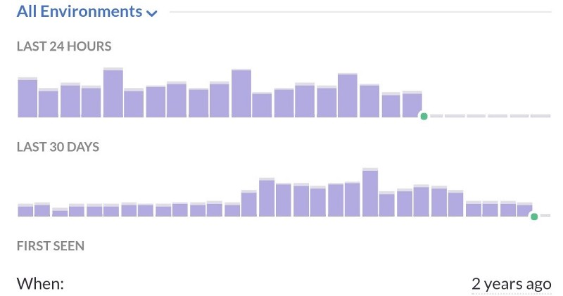

We use [Sentry](https://sentry.io/welcome/) for our error reporting, and we love it. It is simple, gives [options for a lot of different use cases](https://docs.sentry.io/clients/python/advanced/#client-arguments), and can easily be integrated with Django, over which our backend is built. We recently fixed (or ignored :P) an issue we had for a long time. This article is about how we did it.

## The Problem

Because of a [play between Django-Tastypie and Celery-Haystack](https://github.com/django-haystack/celery-haystack/blob/ca590126dd1836d3b1f03e9b9264d02161142e38/celery_haystack/tasks.py#L117), our celery workers ended up throwing a lot _(5 million in 2 years)_ of harmless `ValueError` exceptions. Due to other priorities and a large amount of effort required, we couldn’t get down to fixing the source of these exceptions. But soon we started reaching our rate-limits for errors on Sentry. We needed a way to make sentry ignore these particular errors.

## The Fix

If it was a _logged_ error (like `logger.error`), we could simply [configure Django’s logging](https://docs.sentry.io/clients/python/integrations/django/#integration-with-logging) framework appropriately for sentry, but it was an unhandled exception so that would not work.

There are some options for making sentry exclude particular errors:

1. [`ignore_exceptions`](https://docs.sentry.io/clients/python/advanced/#client-arguments): This is helpful if you want a particular exception to be ignored, and is a more suitable use-case for ignoring custom Exceptions. But we can’t ignore `ValueError` completely since we stand a chance to ignore other genuine Exceptions that must be brought to our notice.
2. [`exclude_paths`](https://docs.sentry.io/clients/python/advanced/#client-arguments): This should have worked (according to the docs) and I should have just needed to append `celery_haystack.tasks`, but that didn’t turn out to be the case. I couldn’t make it work in my testing (we have `raven==5.12.0`)

Getting no headway there, and in the interest of time ([we didn’t want to spend more time than necessary](https://medium.com/squad-engineering/how-we-built-an-engineering-culture-of-doing-more-with-less-a0a053be8e30)), we decided to dig into some code and look for a good way to achieve this by overriding [Sentry Client](https://docs.sentry.io/clients/python/integrations/django/#additional-settings).

Looking into the code revealed that [`skip_error_for_logging`](https://github.com/getsentry/raven-python/blob/f579e6809b01d27da5fe515d8572b497c98b4b43/raven/base.py#L357) is the perfect method to override for our use. We are taking a list of prefixes that can be defined in Django `settings` and testing them against the exception message. If the exception message has one of the specified prefixes, we ignore the error.

Here is our solution:

`gist:ketanbhatt/01f69978fd5a800924a8781e805bffb3`

This provides a lot of control over what exception we want to exclude. And can be extended to check for Exception `type` and `message` together, use regexes, or any other advanced handling we like.

Result? Our hourly error rate instantly came down. Here is one of the heart-warming screenshots :)

The green dots are when the deployment took place

I still have a feeling that `exclude_paths` should have worked, but we went ahead with the solution we could figure out the fastest. If someone knows a better way, please let us know :)

(Originally [posted on my Medium account](https://medium.com/squad-engineering/custom-sentry-client-for-more-freedom-how-to-ignore-any-exception-you-want-e56d36bd515f))
