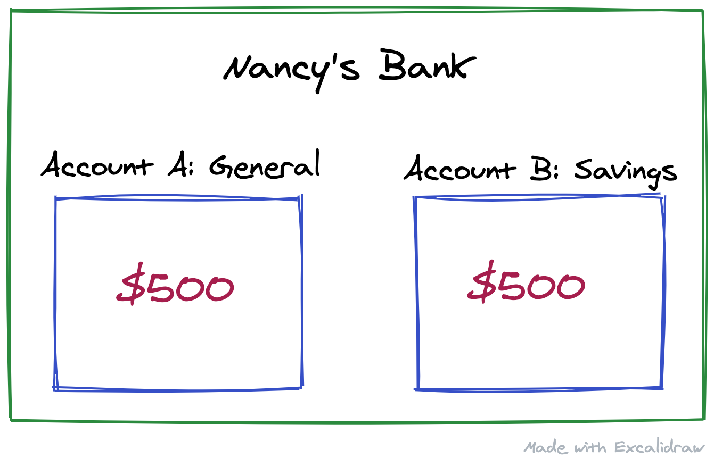
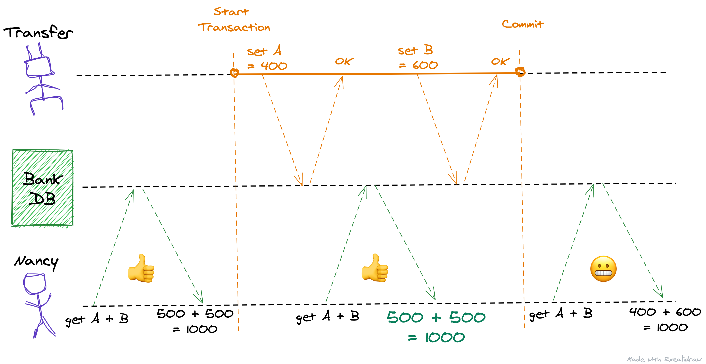
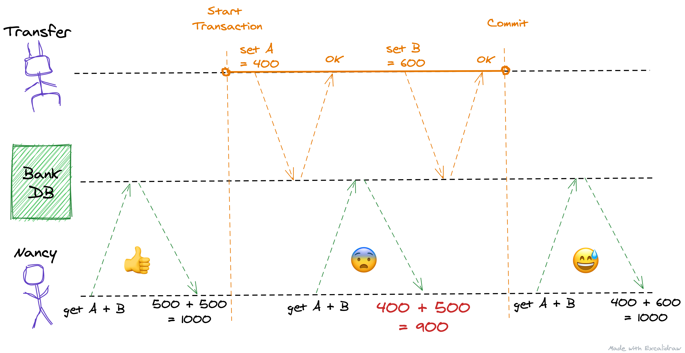
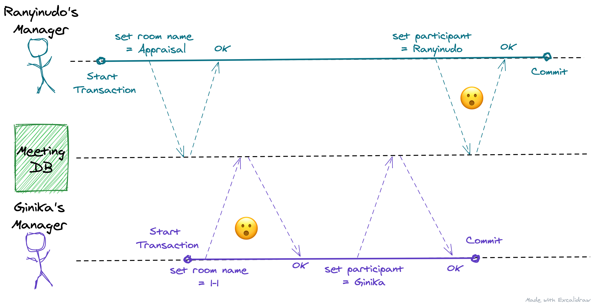
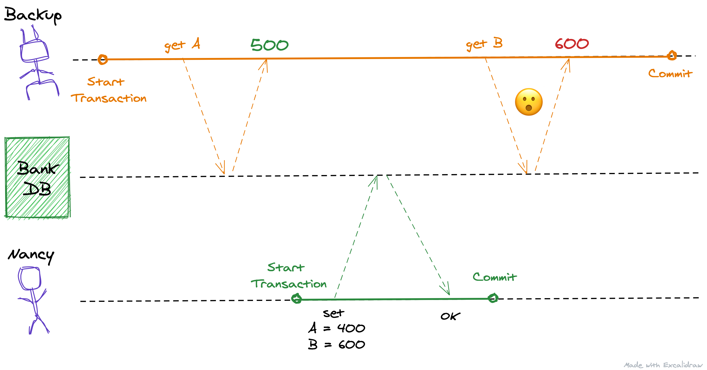
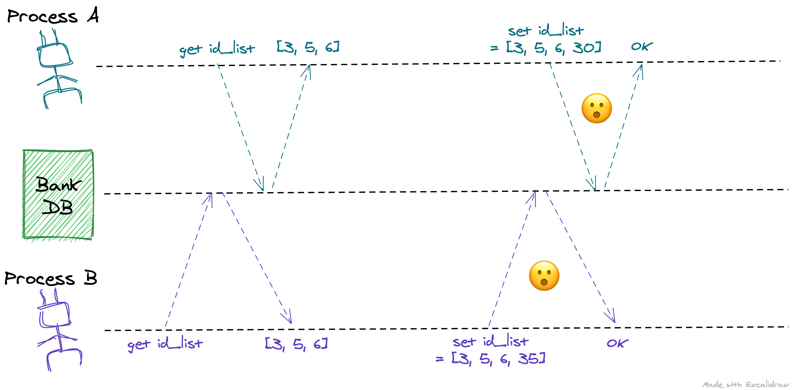
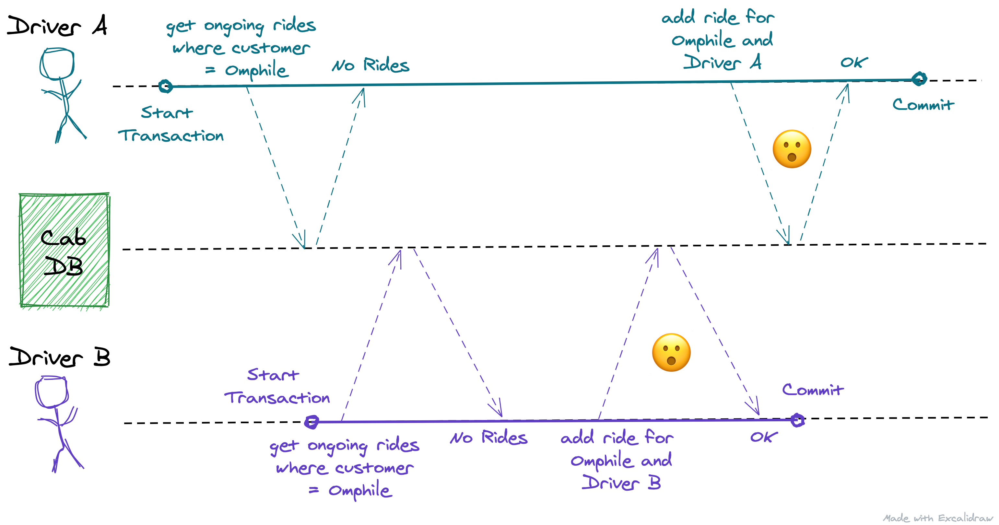

I came across defects caused by race conditions that might occur when we work with databases, while reading [Designing Data-Intensive Applications (DDIA)](https://www.goodreads.com/book/show/23463279-designing-data-intensive-applications), by [Martin Kleppmann](https://martin.kleppmann.com/). It turns out that if we aren't careful, concurrent transactions can cause a lot of headaches, to say the least. Finding it easy to forget or confuse these defects for each other, I decided to catalogue them here so they might help others and future me.

I have derived a bulk of these learnings and examples from DDIA itself, and all the credit for that work goes to Martin Kleppmann.

### First, some basics

Before we start, I want to quickly go over some basics so that a wider audience can follow along more easily.
- **Transaction**
    - A "transaction" groups several reads and writes together into one logical unit. Conceptually, all the reads and writes in a transaction are executed as one operation: either the entire transaction succeeds (commits successfully) or it fails (aborts and rolls back).
    - For a longer explanation, this might be helpful: [What is a database transaction?](https://stackoverflow.com/questions/974596/what-is-a-database-transaction)

- **Commit and Rollback**
    - From [this doc](http://itdoc.hitachi.co.jp/manuals/3020/3020635100e/W3510158.HTM):
    > The process of placing into effect in the database the updates made by a transaction is called commit. The process of invalidating the updates made by a transaction is called rollback

- **Race Conditions or Concurrency Defects**
    - Roughly, if two or more transactions simultaneously access (read or write) the same data, these transactions will be considered concurrent. Based on what operations these transactions perform on the data, we might run into anomalous behaviour like losing writes, or reporting incorrect data, or permanently making the data inconsistent.
    - To get a better idea, take a look at this example: [Race condition example](https://en.wikipedia.org/wiki/Race_condition#Example)

Today, we are going to learn about what Defects can occur due to Race Conditions, and characterise them. That is the first step towards avoiding them 😬

I have strictly kept the scope of this article to be an introduction to defects that can occur because of concurrency. Resolving or avoiding these defects is a larger topic that I might discuss in a later post. For now, I just wanted to make the reader aware of these problems. Knowing that a problem exists is often the first step towards dealing with it.

# Let's begin

## Dirty Read
**Tl;dr: If a transaction can read data written by another transaction that is not yet committed (or aborted), this read is called a "Dirty Read".**

Changes made by an ongoing transaction only become permanent once the transaction commits. If a Database allows other transactions to read updates made by a still uncommitted/incomplete transaction, it can lead to unintended outcomes:

1. If an in-progress transaction makes several changes to the database, and dirty reads are not prevented, other concurrent transactions might be able to see some of these changes while the rest are still being made. This is confusing to users and could cause other transactions to take incorrect decisions.
2. A transaction can abort, requiring its writes to be rolled back. If the database allows dirty reads, another transaction might see data that was later rolled back. This can cause bugs and issues that are hard to reason about.

 
Let's look at an example: Nancy has $1000 in her bank, split equally between two accounts:

- Account A: Her general account that she uses for receiving and spending money
- Account B: Her savings account that she uses for saving money every month (she was saving for a trip to Rome, but we all know nobody is going anywhere in 2020).

Nancy decides to transfer 100$ from Account A to Account B. The Bank makes this transfer by carrying out a transaction with two operations:
1. Subtract 100$ from Account A
2. Add 100$ to Account B

Let's assume that Nancy has her Bank's app open and she is looking at her Account balances while the transfer is happening. Thankfully, her Bank's database prevents dirty reads. This is what she sees:

While looking at the app, Nancy always only sees that data that is committed to the database, and never a partial state.

But if the database did not prevent dirty reads, this is what she could see:

For a moment there, she gets back an incorrect balance which is lower than what she should have. This happened because the database made the partial changes from her transfer transaction visible to Nancy's transaction, even before it was committed.

In this particular case, there wasn't any lasting harm done. She would see her correct balance if she were to refresh again, but not all cases would be this harmless.

Thankfully, dirty reads are prevented by default by all major databases.

#### Related reads:
- [Read Committed in Postgresql](https://www.postgresql.org/docs/current/transaction-iso.html#XACT-READ-COMMITTED)
- [Read Committed in MySQL](https://dev.mysql.com/doc/refman/8.0/en/innodb-transaction-isolation-levels.html#isolevel_read-committed)

## Dirty Write
**Tl;dr: If a transaction can overwrite data written by another transaction that is not yet committed (or aborted), this read is called a "Dirty Write".**

Similar to dirty reads, dirty writes happen when a transaction can access and overwrite data written by a still uncommitted/incomplete transaction. Dirty writes should be prevented because they can lead to messed up partial states caused by the intermingling of writes made by multiple transactions. These states would be difficult to reason about and could cause terrible things to happen.

 
Let's look at an example: Ginika and Ranyinudo are software engineers. Their managers (different people) want to set up a meeting with them. The meeting system makes two database writes while booking a room:

1. It sets the room's name to reflect the meeting
2. It adds the participant to the room

Now, Ginika's manager wanted to schedule a regular 1-1 with her, whereas Ranyinudo's manager wanted to tell her that she is getting promoted (she is going to be a Senior)! They both proceed to book the same room for the same time. As these examples go, their requests for booking the room were concurrent, and their database does not prevent dirty writes. This is what happens:

Because the database allows transactions to overwrite uncommitted data written by other transactions, we have reached this incorrect partial state. Ginika's Manager overwrote the Room's name, and Ranyinudo's Manager overwrote the participant. In this case, disaster was averted because humans are involved, Ranyinudo's manager told her of the database mishap and all was fine. But in the wild, this could lead to a lot problems.

Again, thankfully, dirty writes are prevented by default by all major databases.

#### Is preventing dirty writes enough?
At this point, astute readers might notice that even if dirty write was prevented, one of the transaction would still overwrite the other. And that is correct. But at least the final state would not be a partial state.

In our example, if dirty writes are prevented, the room will be set for an "Appraisal" with Ranyinudo as a participant because Ranyinudo's transaction committed last. If Ginika's transaction would have committed after Ranyinudo's, the room would say "1-1" with Ginika as the participant. Notice how the final state isn't an inter-mingled mess of these 4 writes.

Even though this works out fine for us in this case, this overwriting is still a problem. We will explore this more in [Lost Update](#lost-update).

#### Related reads:
- [Read Committed in Postgresql](https://www.postgresql.org/docs/current/transaction-iso.html#XACT-READ-COMMITTED)
- [Read Committed in MySQL](https://dev.mysql.com/doc/refman/8.0/en/innodb-transaction-isolation-levels.html#isolevel_read-committed)

## Read Skew
**Tl;dr: A transaction (typically, long running) may read different parts of the database at different points in time causing a Read Skew.**

If each query in a transaction can always see the latest committed data, some queries would read an older version of the data, whereas some would read from a newer version. This can result in inconsistencies best explained by an example.

Let's go back to Nancy's example where she was transferring 100$ from Account A to B. Now let's assume that while this transfer is happening, the bank is running a scheduled daily backup of the database. This backup transaction is carried out by querying for all the account balances in the bank. Since a bank usually has a lot of accounts, the backup takes hours to complete.

In a database susceptible to Read Skew, this scenario might occur:

According to this horrible horrible backup (we are the bank), Nancy has a total of $1100 instead of $1000. This happened because when the backup transaction read the balance in Account B, it read the updated version of the balance. Since Account A's balance was read before the transfer, we now have an inconsistency. If this backup is needed to be restored, this inconsistency will become permanent.

Similar to this backup example, Read Skew can cause nonsensical data to be returned by analytical queries that often need to scan over a large number of rows.

**Unfortunately, not all databases prevent this defect by default and you should consider verifying this for your database.**

#### Related reads:
- [Postgresql doesn't prevent this by default. Check out Repeatable Read.](https://www.postgresql.org/docs/current/transaction-iso.html#XACT-REPEATABLE-READ)
- [MySQL's InnoDB engine prevents it by default. Check out Repeatable Read.](https://dev.mysql.com/doc/refman/5.6/en/innodb-transaction-isolation-levels.html#isolevel_repeatable-read)

## Lost Update
**Tl;dr: Two or more concurrent transactions might read the same value from the database, modify it, and write it back, not including the modification made by the other concurrent transactions. This could lead to updates getting lost.**

Lost updates is one of the most common defect that happens due to race conditions. If you have been developing software for a few years, there is a high chance you have caused or experienced bugs because of this problem.

It is an easy defect to cause. Luckily, it is also easy to resolve in many cases. Any situation where we read a value from the database, modify it, and then set it back, could fall prey to this defect. This set of operations can be called a "read-modify-write" cycle. I like to remember it by the fun abbreviation: [TOCTTOU](https://en.wikipedia.org/wiki/Time-of-check_to_time-of-use).

A few scenarios where updates can get lost are:
1. Incrementing a counter
2. Updating an Account Balance
3. Updating a complex value like a JSON or a list.

 
Without troubling Nancy further, let's look at a common example. Assume that we store a list of IDs in redis (or memcached, or any other database). There are two concurrent processes trying to add another ID to this list. Sounds like a recipe for Lost Updates:

Both the processes here read the same list, appended their IDs and then tried writing it back to the Database. Since Process A updated the value last, the update made by Process B will get lost. This tactic of "Last Write Wins" is often used by databases for resolving such conflicts.

Most of the times it is up to the application developer to identify and prevent these kind of lost updates. Being a common problem, there are multiple ways to avoid it:
1. using atomic operations (like [INCR in Redis](https://redis.io/commands/incr)),
2. doing a "compare-and-set" operation (`set id_list = new-value if id_list = old-value`)
3. or taking an explicit lock on the value you are trying to modify.

## Write Skew
**Tl;dr: Write Skew is a generalisation of the Lost Update problem. It is also caused by a "read-modify-write" cycle, but the objects getting modified could be different.**

A generalisation of the lost update problem is when two or more concurrent transactions read the same objects, and then update some of those objects (the transactions might be updating different objects). If the transactions update the same object, a lost update can happen. If they are updating different objects, a write skew can happen. Write skews are also a very common defect that you would have come across in the wild.

 
It is easier to explain with an example. Omphile wants to go to the supermarket and she requests for a cab using the popular ride-hailing app, Sober. The app broadcasts her request to all available drivers, and any driver can accept the request. When a driver accepts a request, the app first checks if an ongoing ride for the customer already exists. If not, the app adds a ride for the given combination of customer and driver.

Conveniently, two drivers accepted Omphile's request at the same time. If the application developers aren't careful, this is how a write skew can occur:

Here, when the drivers checked if an ongoing ride exists or not, both got the right response: No ride exists. Both of them then proceeded to add a ride. Write skew.

Other common scenarios where this problem can surface is when booking a meeting room in a similar fashion to our ride-hailing app, or assigning a username for a user etc. Some of these problems can be resolved by adding a database constraint or taking a lock on the search results. But, like in our example, it is not always possible to take a lock because our query checks for the absence of a row, and therefore there is nothing to take a lock on.

#### Phantoms
A related concept here is the Phantom effect: It occurs when a write in one transaction changes the result of a search query in another transaction. In our example, If Driver A's write would have occurred before Driver B's search, the result would be different.

# 👋
We discussed a lot of defects that can be caused if concurrent requests are executed. In reality, the situation is not as grim as it might look. There are a lot of reliable ways to avoid these defects. My aim here was to give you the vocabulary that helps you identify potential scenarios where these defects can occur in your systems. I hope this has helped.

If this topic fascinates you, I highly recommend you give DDIA a read.
