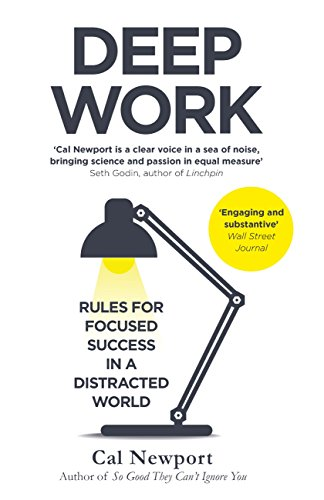
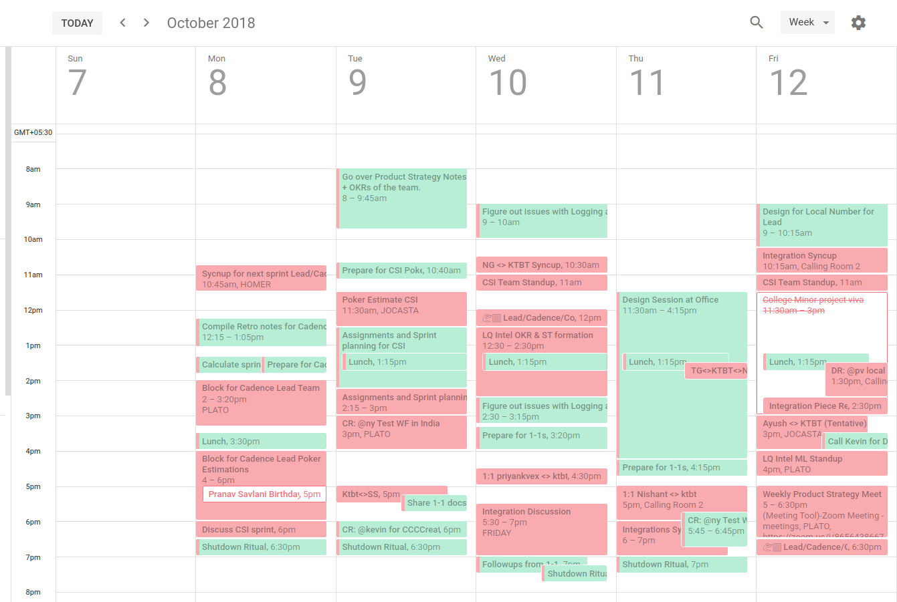

I have always been interested in how to do more meaningful work, and get better and better at what I do. This quest sees me read content which is sometimes technical in nature and sometimes talks about how to be a better leader \[[1](http://ketanbhatt.com/2018/08/12/dont-be-the-alpha-geek-your-team-deserves-better/), [2](http://ketanbhatt.com/2018/05/06/how-i-stopped-being-awful-at-managing-leadership-lessons-from-a-dev/)\].

Sometimes I go a little meta and read about work itself, and how can I do that better. I recently finished reading **"Deep Work: Rules for Focused Success in a Distracted World" by Cal Newport**. There were just so many ideas I wanted to remember and apply to my life, and I was unable to keep track of them. I decided to condense the learnings for myself for future reference and put it in a blog ([because I don't want my keystrokes to die](https://jamesclear.com/keystrokes)).

###### Disclaimer: Most of the text here has been directly lifted from the book. I have marked the text at most of the places by putting them in quotes or italicizing them. This is done because it was impractical to put the author's name after every line. Remember, this is just a condensed version of the book.

#### Deep Work:

> Professional activities performed in a state of distraction-free concentration that push your cognitive capabilities to their limit. These efforts create new value, improve your skill, and are hard to replicate.

#### Shallow Work:

> Noncognitively demanding, logistical-style tasks, often performed while distracted. These efforts tend not to create much new value in the world and are easy to replicate.

## Why Deep Work?

### The Deep Work Hypothesis

> The ability to perform deep work is becoming increasingly rare at exactly the same time it is becoming increasingly valuable in our economy. As a consequence, the few who cultivate this skill, and then make it the core of their working life, will thrive.

### Deep Work is Valuable:

- The ability to quickly master hard things. If you can't learn, you can't thrive.
- The ability to produce at an elite level, in terms of both quality and speed. If you don't produce, you won't thrive - no matter how skilled or talented you are.

These two abilities depend on your ability to perform deep work.

### Deep Work is Rare:

_"Getting deep work done is getting increasingly rarer. Big trends in business today (open offices, real-time messaging etc.) actively decrease people’s ability to perform deep work."_

Other reasons why it is difficult to get Deep Work done:

#### The Metric Blackhole:

A lot of the behaviours that distract us from doing Deep Work won't survive long if it was clear that they were hurting the bottom line, but **the metric black hole prevents this clarity and allows the shift toward distraction we increasingly encounter in the professional world.**

For example, if you could know how much time you spend each day on emails or slack, or just deciding what to do next, you would know how much time of your day you are whiling away. But it is difficult to track these metrics (although not so much anymore!).

#### **The Principle of Least Resistance:**

> In a business setting, without clear feedback on the impact of various behaviors to the bottom line, we will tend toward behaviors that are easiest in the moment.

Some examples:

1. **Instant Messaging**: It is easier to get a response quickly when you need it rather than plan your day carefully in advance and be prepared to put things aside for a while and turn your attention elsewhere while waiting for what you requested.
2. **Regular standups**: _"For many, these standing meetings become a simple (but blunt) form of personal organization. Instead of trying to manage their time and obligations themselves, they let the impending meeting each week force them to take some action on a given project and more generally provide a highly visible simulacrum of progress."_
3. **Thoughts?**: _"Consider the frustratingly common practice of forwarding an e-mail to one or more colleagues, labelled with a short open-ended interrogative, such as: “Thoughts?” These e-mails take the sender only a handful of seconds to write but can command many minutes (if not hours, in some cases) of time and attention from their recipients to work toward a coherent response. A little more care in crafting the message by the sender could reduce the overall time spent by all parties by a significant fraction."_

#### **Busyness as a Proxy for Productivity:**

> In the absence of clear indicators of what it means to be productive and valuable in their jobs, many knowledge workers turn back toward an industrial indicator of productivity: doing lots of stuff in a visible manner.

## The Rules

**Why do you need rules? Isn't just knowing that you need to get "deep work" done enough? You are an adult, sure you can handle it?**

**NO:**

> **You have a finite amount of willpower that becomes depleted as you use it.**
>
> Your will, in other words, is not a manifestation of your character that you can deploy without limit; it’s instead like a muscle that tires. This is why the subjects in the Hofmann and Baumeister study had such a hard time fighting desires—over time these distractions drained their finite pool of willpower until they could no longer resist. The same will happen to you, regardless of your intentions—unless, that is, you’re smart about your habits.
>
> **The key to developing a deep work habit is to move beyond good intentions and add routines and rituals to your working life designed to minimize the amount of your limited willpower necessary to transition into and maintain a state of unbroken concentration.**

### 1. Decide on Your Depth Philosophy

There are multiple ways/philosophies to structure your time so that it is easy to get deep work done. I am just putting the names here (you can search about them if you want).

1. The Monastic Philosophy
2. The Bimodal Philosophy
3. **The Rhythmic Philosophy:** This is the most suitable one in my case.
4. The Journalistic Philosophy

#### Rhythmic Philosophy:

_This philosophy argues that the easiest way to consistently start deep work sessions is to transform them into a simple regular habit. The goal, in other words, is to generate a rhythm for this work that removes the need for you to invest energy in deciding if and when you’re going to go deep._

### 2. Ritualize

> An often-overlooked observation about those who use their minds to create valuable things is that they’re rarely haphazard in their work habits.

Rituals act as triggers/cues for the brain. Having a ritual tells your brain when is it time to go into the Deep Work mode. The ritual could consist of details like:

1. **Where you’ll work and for how long**
2. **How you'll work once you start to work:** _"Your ritual needs rules and processes to keep your efforts structured. For example, you might institute a ban on any Internet use, or maintain a metric such as words produced per twenty-minute interval to keep your concentration honed. **Without this structure, you’ll have to mentally litigate again and again what you should and should not be doing during these sessions and keep trying to assess whether you’re working sufficiently hard. These are unnecessary drains on your willpower reserves.**"_
3. **How you’ll support your work:** _"Your ritual needs to ensure your brain gets the support it needs to keep operating at a high level of depth. For example, the ritual might specify that you start with a cup of good coffee, or make sure you have access to enough food of the right type to maintain energy or integrate light exercise such as walking to help keep the mind clear."_

### 3. Give yourself downtime

Maintain a clear endpoint to your workday.

1. Downtime aids insights
2. Downtime helps recharge the energy needed to work deeply
3. The work that evening downtime replaces is usually not that important

#### **Shutdown Ritual**

The Shutdown ritual should ensure that every incomplete task, goal, or project has been reviewed and that for each you have confirmed that either

1. you have a plan you trust for its completion, or
2. it’s captured in a place where it will be revisited when the time is right.

_The concept of a shutdown ritual might at first seem extreme, but there’s a good reason for it: **the Zeigarnik effect**. This effect, which is named for the experimental work of the early-twentieth-century psychologist Bluma Zeigarnik, describes the ability of incomplete tasks to dominate our attention. It tells us that if you simply stop whatever you are doing at five p.m. and declare, “I’m done with work until tomorrow,” you’ll likely struggle to keep your mind clear of professional issues, as the many obligations left unresolved in your mind will, as in Bluma Zeigarnik’s experiments, keep battling for your attention throughout the evening (a battle that they’ll often win)._

### 4. Embrace Boredom

**The ability to concentrate intensely is a skill that must be trained.** Efforts to deepen your focus will struggle if you don’t simultaneously wean your mind from a dependence on distraction. Much in the same way that athletes must take care of their bodies outside of their training sessions, you’ll struggle to achieve the deepest levels of concentration if you spend the rest of your time fleeing the slightest hint of boredom.

Once your brain has become accustomed to on-demand distraction, it’s hard to shake the addiction even when you want to concentrate.

> **If every moment of potential boredom in your life—say, having to wait five minutes in line or sit alone in a restaurant until a friend arrives—is relieved with a quick glance at your smartphone, then your brain has likely been rewired to a point where it’s not ready for deep work—even if you regularly schedule time to practice this concentration.**

### 5. Meditate Productively

We have all done this unknowingly, but now we have a phrase for it: "Meditating Productively".

The goal of productive meditation is to take a period in which you’re occupied physically but not mentally—walking, jogging, driving, showering—and focus your attention on a single well-defined professional problem. Depending on your profession, this problem might be outlining an article, writing a talk, making progress on a proof, or attempting to sharpen a business strategy.

As in mindfulness meditation, you must continue to bring your attention back to the problem at hand when it wanders or stalls:

1. Be Wary of Distractions and Looping
2. Structure Your Deep Thinking

### 6. Schedule every minute of your day

Schedule because then you don't have to think what you should be doing every time you finish a task. This removes a lot of shallow work from your day because we spend a majority of that time going over all those slack channels, and whatnot.

This scheduling is not bounding, but supportive in nature. It is not like once you have set a schedule you can't change it. Yes, you can! **You just readjust and re-prioritise your day according to the time you have left or incoming work. This further reduces any shallow work because now you will focus on the more important tasks at hand.**

### 7. Fixed-schedule productivity

Finish your work by 5:30 forcing yourself to not spend time on the shallows.

> **I call this commitment fixed-schedule productivity, as I fix the firm goal of not working past a certain time, then work backward to find productivity strategies that allow me to satisfy this declaration.**
>
> I’ve practiced fixed-schedule productivity happily for more than half a decade now, and it’s been crucial to my efforts to build a productive professional life centered on deep work.

I am still struggling with this, but I understand the reasoning and try to wind up my day earlier than any normal Startup employee would :D

### 8. Become hard to reach

1. Make people who send you e-mail do more work
2. Do more work when you send or reply to e-mails (Process-Centric Responses)
3. Don't respond (**Professorial E-mail Sorting)**: Do not reply to an e-mail message if any of the following applies:
    1. It’s ambiguous or otherwise makes it hard for you to generate a reasonable response.
    2. It’s not a question or proposal that interests you.
    3. Nothing really good would happen if you did respond and nothing really bad would happen if you didn’t.

 

The book is filled with tonnes of actionable insights and I have only documented those that I found relevant for myself.

Please read the book to understand the reasoning behind each of these suggestions in greater detail.
