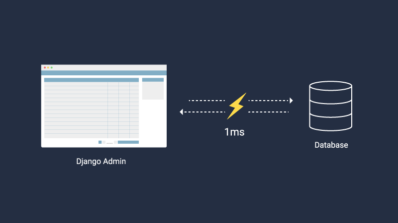

Short story of how we reduced the response time of some of our admin pages by **1000x**.



## The Problem

One of our tables grew to over 25 million rows. Which, while not a large number, makes the most frequent queries slow.

A direct effect it had was on our Admin panel. The `change_list` form for the model started taking ages to load. Our Operations team uses the Admin 24\*7 for most of what we do, we could see them grumbling about how slow things have become as they had to sit for **2–3 seconds minimum before the page would load completely**. This lead to low efficiency for at least 10 people every day. This had to be fixed.

We had already done stuff like using `select_related` or `prefetch_related` on the related items to reduce the number of queries, what else could we do? On some investigation (Thank you [DDT](https://django-debug-toolbar.readthedocs.io/en/stable/)), we found out that a certain `count` query was taking 98% of the total time taken by SQL queries on that page. It was clear that this `count` query would be painfully slow for large tables. Why was this query being made? For the admin’s paginator to work.


*Pagination in Django Admin*

## The Solution

It was clear that the pagination logic will have to change. Our requirement with the admin was just to give an estimate of the number of rows that were there, and be able to navigate from one page to the another. For that, we would need a faster way to get the count of rows in a table.

We are using **PostgreSQL** and it has wonderful docs for things like how to [estimate counts](https://wiki.postgresql.org/wiki/Count_estimate). PostgreSQL maintains metadata about the database in [system catalogs](https://www.postgresql.org/docs/9.1/static/catalogs.html). One such catalog is the [`pg_class`](https://www.postgresql.org/docs/current/static/catalog-pg-class.html). On every `VACUUM`, `ANALYZE`, or for commands like `CREATE INDEX`, postgres updates the relevant rows in `pg_class`. So instead of getting count like:

```sql
SELECT COUNT(*) AS "__count" FROM "my_table"
```

We could get a rough estimate by doing:

```sql
SELECT reltuples FROM pg_class WHERE relname = 'my_table'
```

**_This query takes no more than 1 ms to complete!_**

To integrate it with Django’s `ModelAdmin` seamlessly, we created a custom Paginator:

`gist:ketanbhatt/846644beb59457485a3decd8dec6a4c4`

And we are sorted. Lightening fast page loads are back, and our Operations team is happy.

**UPDATE:** The code has been updated to be compatible with Django ≤ 1.11

## The Future

You can extend the work done here to make a more generic library:

1. By making a queryset method that returns the approximate count. This method can then be used anywhere you just need an estimate of the count.
2. By checking for `connection.vendor` before estimating, and using database specific queries.

## and, The Gotchas

The custom paginator is not suitable with tables having small number of rows. This is because:

1. Sometimes the admin will not show any rows for a given model. That will be because the `reltuples` for that table in `pg_class` returned `0`. This happens with small tables which have never been analysed/vacuumed. (Running an `ANALYSE` for these tables will fix these, but read point 2)
2. They generally get analysed/vacuumed with lesser frequency and the percentage deviation from the actual values will be higher here.

Other than that, this just works with PostgreSQL _(but there should be similar ways to estimate counts in other databases as well)_.

(Originally [posted on my Medium account](https://medium.com/squad-engineering/estimated-counts-for-faster-django-admin-change-list-963cbf43683e))
