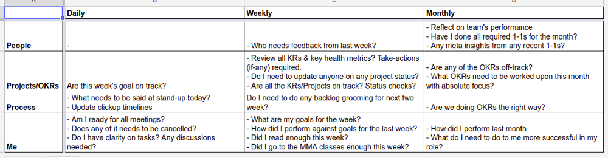
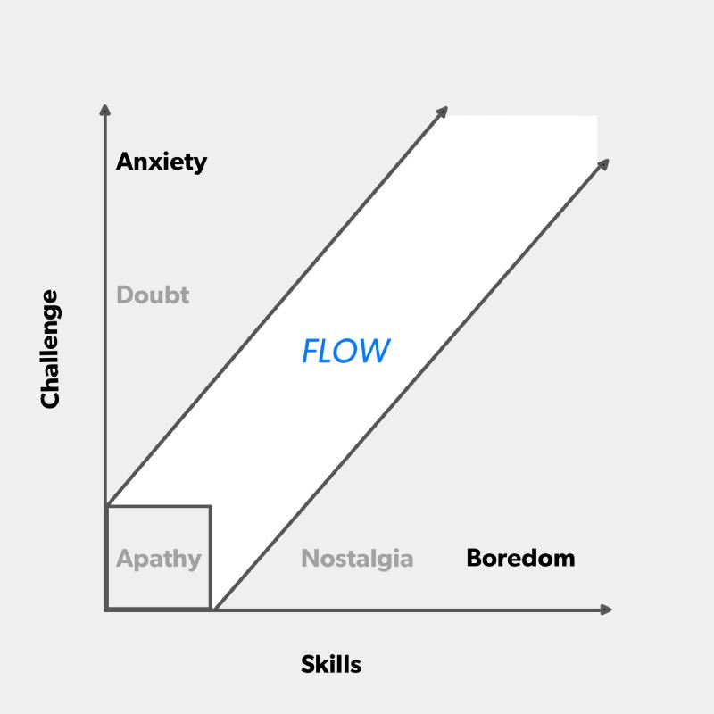

At [Squad](https://www.squadplatform.com/), we have been following the concept of having small inter-disciplinary teams, which we call Solver Teams (the concept is beautifully [explained by Spotify](https://labs.spotify.com/2014/03/27/spotify-engineering-culture-part-1/), we took a lot of inspiration from them). As fate would have it, I got to lead a team responsible for building the Machine Learning platform for Squad, from scratch.

While I have been working on large projects for over 2 years now, this was my first time taking on a more formal leadership role. A solver team lead is more a Project Manager than a People Manager, so I was not just managing, but also executing. This probably made the much-dreaded transition easier. I enjoyed and learnt a great deal these past few months and **I totally sucked in the beginning**. But I am glad to announce that by the end I was much less awful than I was at the start.

How did I become less awful? By learning from my own experience, but more so from the feedback that I got from the team. I recently collated these lessons and 1–1 notes during my quarterly retrospection (ignore the fact that it was my first time trying it, and stay impressed), and realised that it would make for a good read for people who are/were/will be in the same boat as me.

Here are some ideas I found useful:

## Nurture an environment where all ideas are worth sharing

A team is a cocktail of all the different personalities that the members carry. Not everyone will be equally comfortable in sharing an idea they might have. Some people might not be confident about their ideas (which might not be a correct judgement on their part), some would avoid speaking unless directly spoken to, while some are not just used to speaking amongst that particular group of people yet (maybe it’s a new team). Despite all this, how do you get everyone to share ideas?

What I have learnt is that **you can get people to share ideas that they have by asking the right questions**. Questions that I frequently ask, when we have a problem at hand, are:

1. What do you suggest we do?
2. What do you think are some ways we can solve it?
3. Do you think there is a case where the solution will fail?

**Ask these questions, and then pause**. Give them time to think. More than that, **let silence encourage the other person to speak**. Chris Voss describes this as “[effective pause](http://blog.blackswanltd.com/the-edge/how-to-use-silence-to-your-advantage)” in his book “[Never Split the Difference](https://www.goodreads.com/book/show/26156469-never-split-the-difference)”. It is not in the same context, but I have seen it work because the premise remains the same. Effective pauses make people gather their thoughts and think. A typical conversation at the office goes like:

> **John Doe (hypothetical teammate)**: So, there is this issue. What do you think should be done?
>
> **Ketan Bhatt**: Interesting… What do you think should be done?
>
> **JD**: …?
>
> **KB**: … :)
>
> **JD**: …
>
> **KB**: …
>
> **JD**: Well… I guess we could try doing X?
>
> **KB**: Makes sense, what do you think the situation would look like if we do X?
>
> **JD**: There might be some issues with this particular thing, but that can be handled if we do a little tweak to X.
>
> **KB**: Looks good, will the design hold when we also have to do this other thing we had in the backlog?
>
> **JD**: Hmm, let me think more and get back to you?
>
> **KB**: Sure!

Everyone who faces a problem also knows at least one way to solve it. Sometimes that way is all that is needed, sometimes it might need some tweaking. Otherwise, you can always suggest something you think might work and then discuss the solution further.

You do this enough number of times, people automatically start doing this on their own, refining their ideas, and then finally coming to you to share what they have got. And since now there are more people sharing their ideas, your solution bank just grew larger, and the quality of your team’s problem solving, as a unit, goes up. Woot woot!

## Build an Event Loop

We have all been there. The project kicks off with meticulous plans, timelines, and metrics that we vow to keep track of. A few weeks into the quarter, the timelines and the metrics aren’t being tracked with the same punctuality, if at all. I fell victim to this as well.

We, as engineers, have an inherent inclination towards execution. It becomes easy to forget/procrastinate updating the timelines, backlog, skip stand-ups, planning for the coming weeks, etc. What follows is a loss of visibility:

1. Your team doesn’t know where it is heading, will we meet our goals, are we on the right track?
2. The other teams lose sight over what is going on with your team
3. You catch hold of issues, that can jeopardise the goals, too late. Course correction becomes harder.

Learning from mistakes and guidance from my lead, **here is a suggestion: build yourself an** **[Event Loop](https://s3.amazonaws.com/marquee-test-akiaisur2rgicbmpehea/dgVXCQ87Ry2aeL7OKJyu_Screen%20Shot%202015-07-16%20at%2011.43.16%20AM.png)****, and block your time explicitly for following it**. We got this from a [FirstRound Post by David Loftesness](http://firstround.com/review/this-90-day-plan-turns-engineers-into-remarkable-managers/) which is a must read if you are making the transition for a developer to a managerial role.

A lot of us follow something of this sort already, I found that making it explicit just works better for me.

*My Event Loop*

## Balance thy sprint well

My learnings are perfectly explained by Alan Page, Quality Director at Unity, in [his Manager Readme](https://github.com/angryweasel/managerreadme#3-improvement-is-a-prioirity). Specifically:

> **_The ACM framework_** _(Ambitious, Comfortable, Mundane). The idea is that if you look at the work you do over a week / sprint, some of that work is new, challenging, or ambitious, a big chunk of work is stuff that you’re just really good at (comfortable work), and you may end up with some work that you’re overqualified for, or is boring, but that just needs to get done (mundane)._

> _We should work together to make sure you have enough ambitious work that you are challenged and growing, if you’re not learning something new every week, that’s something we should work on together. We also want to minimize your mundane work. Often, your mundane work may be someone else’s ambitious work._

Vikas Gulati, CTO at Squad and my mentor, often points to the following diagram, from [this First Review post](http://firstround.com/review/track-and-facilitate-your-engineers-flow-states-in-this-simple-way/), for explaining roughly the same thing:

*Skills vs Challenge*

It is common knowledge that any good developer won’t be too happy if they don’t see themselves growing. But an overlooked fact is that growing is a continuous process, and not a badge that you get by working hard for a month. **It is easy to burn out people by assigning ambitious tasks to them one after the another (with good intentions on your part)**, and it is often too late by the time one realises that some irreversible damage has been dealt. **Another important aspect is gratification**. Some tasks are challenging but provide gratification early, while for some it might come in much later.

Your sprint is like a dessert. Too much sugar? Thank you for the Diabetes. Too little? Is it even a dessert? And what about the nuts and cherries? Can’t have too much or too few of them as well. The perfect dessert is just the right amount of sweet, with nuts and cherries that randomly surprise you when you take a bite.

**A sprint, much like a dessert, should be a good mix of challenging and comfortable work, with wins spread for good measure :)**

These lessons might be just common sense to some (you have my respect people), but I felt that knowing these things explicitly just helped me channel the team’s strength in a better manner, and, thus, do justice to their talents.

_(Originally [posted on my Medium account](https://hackernoon.com/how-i-stopped-being-awful-at-managing-leadership-lessons-from-a-dev-d1bfebcb3a21))_
