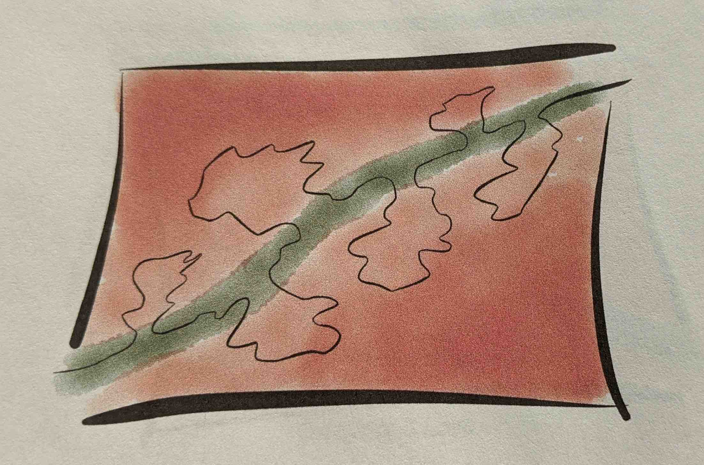
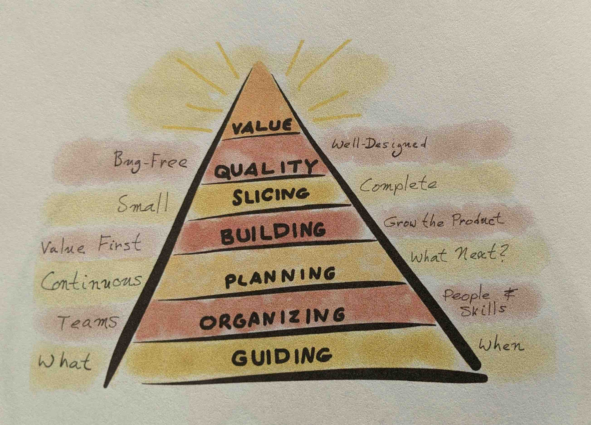
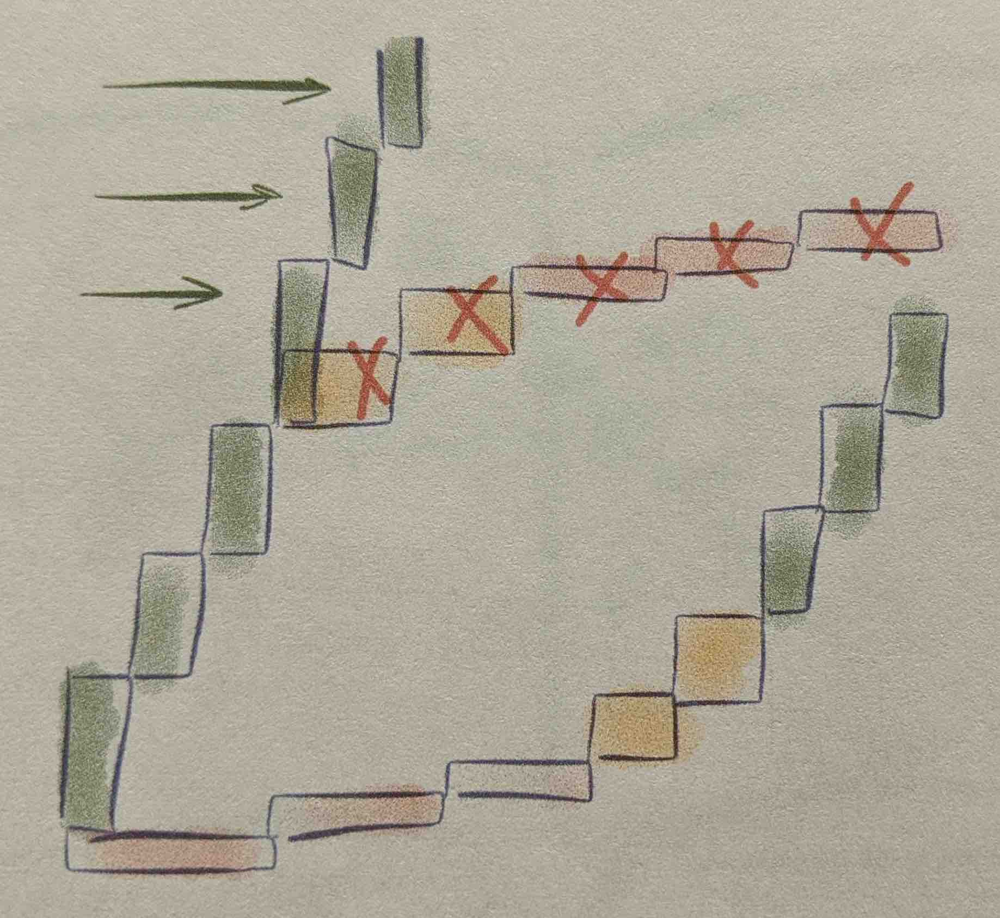
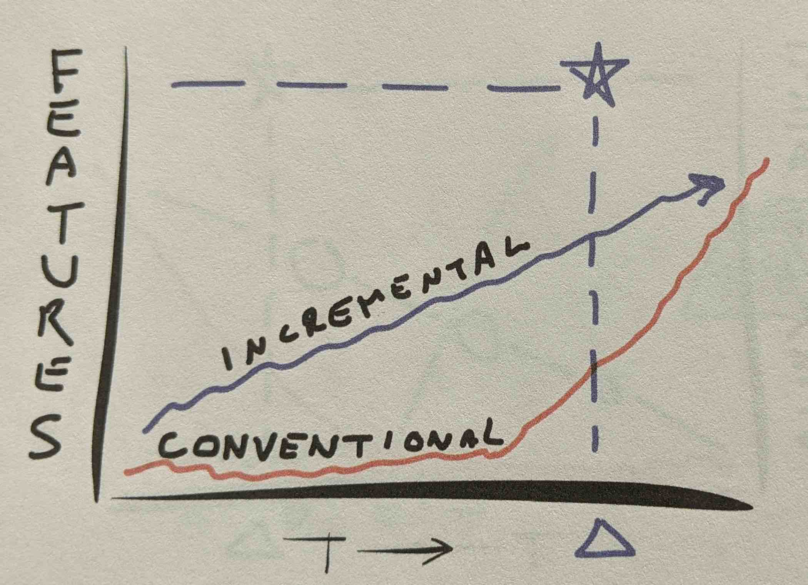
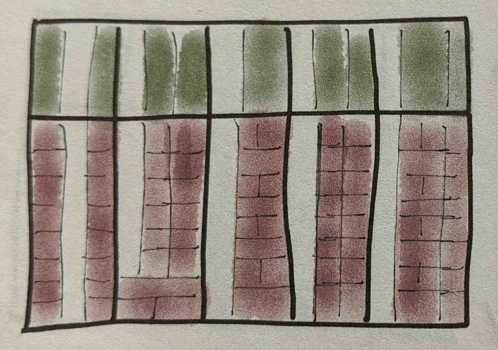
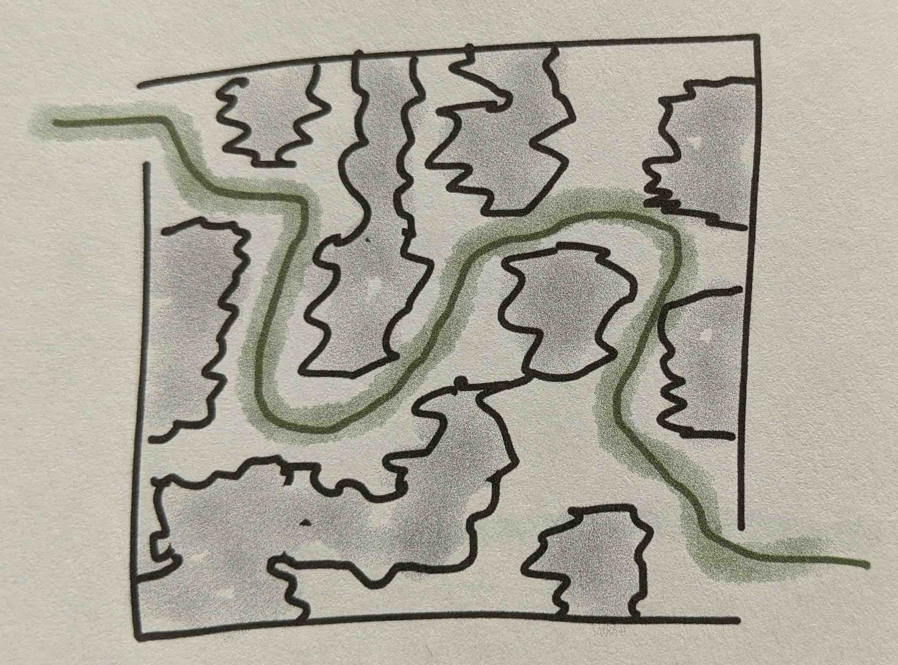

Ron introduces a simple notion of **"The Natural Way"** of Software Development: **Focus on delivering value early and often**.

Building software is like walking in a room where the floor is lava, but there is a path of cool, green, grass that you can walk on and be safe. This path exists and is the "Natural Way". We can't stay on this Natural Way all the time, but it is good to know that this path exists so you can try and come back to it when you wander too far off.

## The Pyramid of Value

## Value: What we want

Value starts when we ship the software. What if we shipped some valuable part sooner than the rest? Most users don't use every feature of the product. Since most users don't use all the features, a smaller set of feature can provide real value, and provide it sooner.

After that first release, we may need to follow up with the rest of the product. But there can be times when you released the first bit and then stopped.  Releasing early gives Information which is value as well. Sometimes the most important information we can get is that we are doing the wrong thing. Fail fast.

While choosing what to work on, choose work that is low effort but high value. When we work like that, we can start delivering value early, and in most of the cases, end up providing more net value because we might choose to work on other high ROI tasks for some other product, or realise we don't need some low ROI features etc.

**Best value comes from small, value-focused features, delivered frequently.**
MMF: Minimal Marketable Features: Pieces that make sense to us, and to our users.
Features: More granular than MMF.

## Guiding goes better "feature by feature"

Tl;dr: Don't do waterfall. This chapter was not particularly useful since a lot of the modern teams follow the practices described here by default.

Two types of "Guiding"

1. **Activity based phases (Waterfall)**:
    1. Analysis —> Design —> Coding —> Testing.
    2. You end up planning for features your might not get to or which are not useful.
2. **Feature by feature**:
    1. More visibility as your project progresses, since you start seeing the software. You will not know how your project is going until you start seeing value.
    2. Sometimes you might even change features etc. based on the information you are receiving from the features you already released

Teams decide a deadline, and they want "everything" done by that deadline. **Years of experience has taught us that this never happens.** You end up either delivering lesser value, or deliver it late, or both. When we know this truth, why not work for it in a manner that makes it possible for us to deliver value early, and gives us better visibility over the progress (and not spring surprises at the last moment).

## Organising

Feature teams >> Function teams

## Planning feature by feature

> Plans are useless, but planning is indispensable
>
> *- General Eisenhower*

Visions are grand ideas, vague yet enticing. But how do you go from there to small detailed features? Planning shouldn't involve a detailed list of what needs to happen and at what time. Planning should be:

1. Identify key feature that we will need to have early
2. Features we can't live without
3. Defer implementing low-value ideas indefinitely. Let's not waste time thinking about and keeping track of them.

**Planning is important. We probably have to consider a lot of bad ideas to get a few good ones. Plan, but stay loose and ready for change.**

Software people are terrible at estimating because humans are terrible at estimating. Let's not try harder to estimate, let's find a better way:

1. Set a time and money budget: [Appetite (Shape Up)](https://basecamp.com/shapeup/1.2-chapter-03#setting-the-appetite)
2. Produce the most valuable features first
3. Keep the product ready to ship at any time
4. Stop when the clock runs out.

How do you get started on a project?

1. Get a team, do a time bound spike, and
2. figure out what we can do to provide value and about how long will it take.

**Don't just plan in the beginning, plan all the time**. Work in sprints. And work with stories.

Important: **Don't take a big story and break it down into smaller technical items, called tasks.** Using tasks mean Business people don't have clear visibility over how things are going, and often don't know how to help. Stick with stories. Break down stories into smaller stories, each making sense to business-side people, rather than technical steps.

### How much should the team take on

1. The team should decide this
2. **Yesterday's Weather**. You will probably get as much done this iteration as you did in the last iteration

### Sprint planning

Discuss what all needs done, roughly discuss what will it take to get those things done. Estimate roughly (number of days?) on an aggregate level. Don't estimate individual work pieces etc. Remember, the point isn't to make good estimates, but to do good work at a consistent pace.

**Fight off the desire to estimate things strongly. With estimates comes the need to "improve" them or compare them. Both these practices are pernicious.**

On stretch goals: They are meant to be stretch goals, but people tend to try to meet them. Eager to please, they will unconsciously hurry, leave out a few tests, leave the code not quiet as clean as they might have etc. just to squeeze in one more feature. This creates pressure. Avoid it.

Generally speaking, estimates are likely to be wrong, and they focus our attention on the cost of things rather than on value. Consider de-emphasizing or eliminating cost estimates and steering to success by a focus on value.

## Building the product, feature by feature

Each iteration is a full product development cycle. People giving the requirements (product managers, Business people) also need to learn how to break down their big ideas into smaller requirements. As you go, it means more product understanding, tightening what is a must have and what are nice to haves.

## Build features and foundations in parallel

Ok, so you are building everything feature by feature. That's cool. But how do you build the foundation feature by feature? By this I mean the overall system design.

You could build out the whole infra/design before hand and then build features, or build each feature completely, with its own infra one at a time. Both means that you will end up delivering lesser value in the given time.

Ron suggests that we create simple and functional features and designs to begin with, and keep improving it with every feature. This helps because you can now deliver the most value in the time + you are just learning about your product. There is no point over spending time on the foundation or a particular feature, when we might learn later that this is not what we wanted.

**Build simple and functional versions first.**

Of course this will take skill. For the PM to understand what mix of features do they want first. And for the devs, how much to design so that when needed, those designs can be changed or modified to handle other requirements. If the design needs to be scrapped, then it is desirable that you have sent less time on it etc. This is a skill that the team will need to learn.

## Bug free

Write automated tests.

## Assorted notes

### Don't whip the ponies, help them improve

- Don't try make more progress by asking developers to "work harder". "Work Smarter" instead, and that means you need to help the team work smarter. "Work smarter, not harder" means that we have to help them get smarter.
- Before focussing on individual productivity, work on team productivity. Analyse the sources of delays. Make sure the team has all the skills needed to do the work. Team members with key skills should be full time, not shared. Use specialists to increase other individual's abilities. Value working together.
- Increase individual productivity by increasing capability, and not by urging people to work harder.

### Twisty little passages: Technical Debt

- The time needed to build a feature comes from two main components: its inherent difficulty, and the accidental difficulty of putting it into whatever code already exists. **Teams are good at estimating the inherent difficulty. What makes us erratic, what makes us slow down, is the accidental difficulty. We call this difficulty "bad code."**
- If we allow code quality to decline, some features go in easily, sailing right through. Others that seem similar get entangled in twisty little passages of bad code. Similar work starts taking radically different amounts of time.
- To keep progress steady, we have to avoid building twisty little passages, and when we do build then, we need to straighten them out.

Fin.
